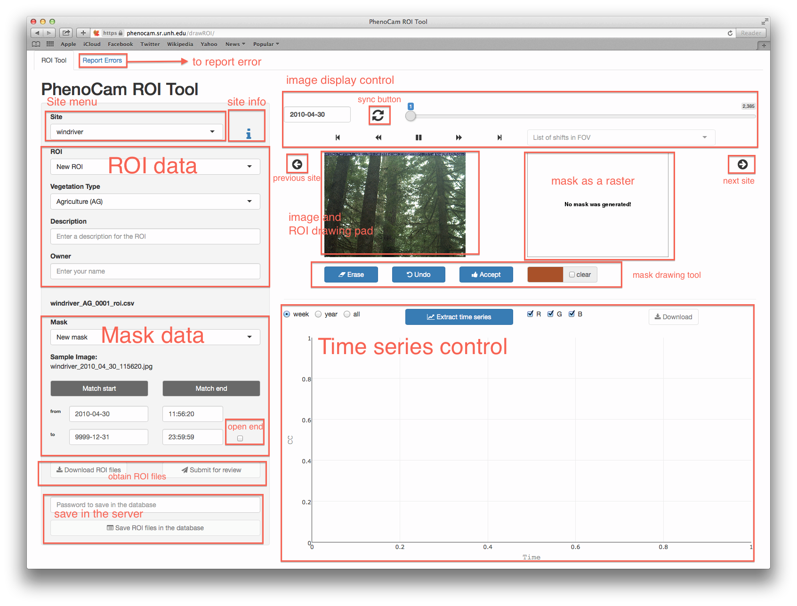

Getting started with drawROI
================

### Introduction

**drawROI** is an interactive application that facilitates extraction of time-series data from digital repeat photography. Although the main purpose of **drawROI** is to serve the [PhenoCam Network](https://phenocam.sr.unh.edu/), it significantly facilitates extraction of phenological data from any stack of digital repeat photography images.

**drawROI** provides a responsive environment for phenological scientists to interactively a) delineate [ROIs](https://en.wikipedia.org/wiki/Region_of_interest), b) handle field of view (FOV) shifts, and c) extract and export time series data characterizing image color (i.e. red, green and blue channel digital numbers for the defined ROI).

### A quick tutorial:

Following steps explain how to extract time-series data from user-delineated ROI:

1.  Select a site from the site menu
2.  From the ROI menu, start a new ROI or just see old ones
3.  Enter a description text and enter your name as the owner
4.  From the mask menu, start with a new mask or edit old ones. Select the appropriate date range.
5.  Find your favorite image of the site and start drawing a region of interest (ROI) by tapping/clicking on the image. To add a new polygon, double click anywhere on the image. You can undo or start over using the buttons.
6.  Whenever you have your own polygon(s), accept it as a mask by clicking th Accept button. The rasterized mask should appear on the right panel.
7.  Download your ROI files using the left panel for your own record
8.  Submit the ROI files by clicking the Submit button
9.  You can also extract the time series of RGB bands from the bottom right panel and download the data in a csv format. This may not be fast if you select a year or the entire data.

